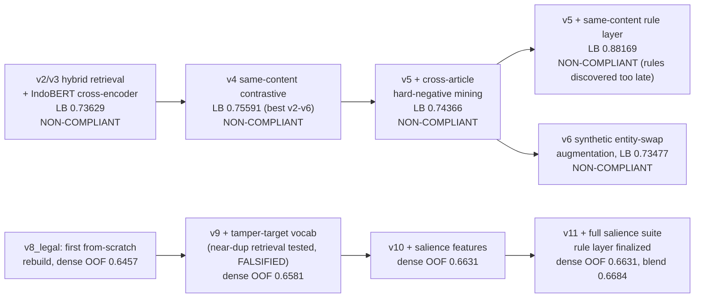
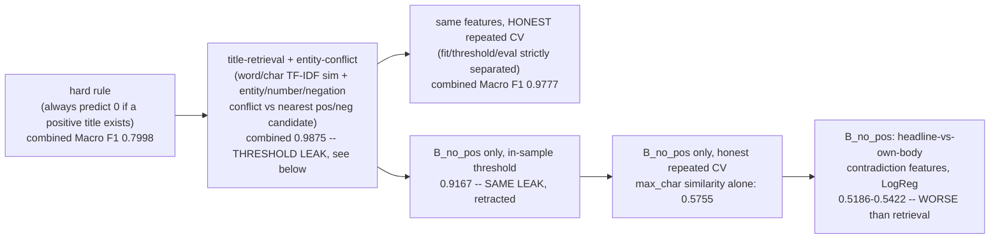
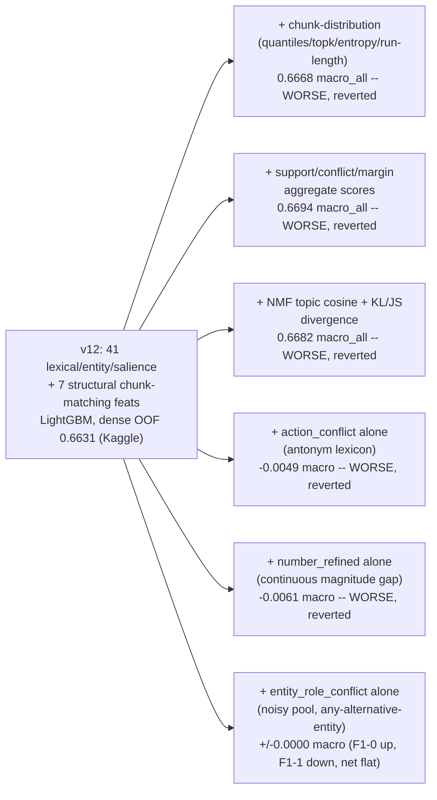
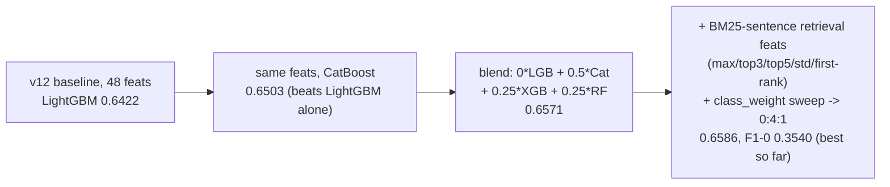

# Experiments

Written by hand from the session history (no automated lineage tooling in this repo —
see `CLAUDE.md` for why). Grouped by regime, since `C_exact` / `B_has_pos` / `B_no_pos` /
`A_cold` turned out to need genuinely different methods, not one shared model.

**Primary metric:** `macro_f1` (maximize). All scores below are honest cross-validation
(grouped by `content_hash` where regime membership requires it, repeated-split where the
regime needs the mixture to appear at all) — **never** the leaderboard score used for
selection. See `SUBMISSIONS.md` for the actual Kaggle history.

## Pre-session history (v2–v11, see `_diag_cache` and old `notebook_v*` dirs)

Everything from `v8` on is compliant (no pretrained weights). Rule-C-copy and
`B_no_pos`-rule were ablated OFF `v11` onward (worth −0.0016 and 0.0000 respectively —
see `C_exact` section below for why that number is misleading in isolation).

## `C_exact` — exact (title, body) pair already in train (25.7% of test)

| method | Macro F1 | note |
|---|---|---|
| rule: copy known label | **1.0** | provably correct — 0 label noise ever observed in exact pairs |
| deferred to model (rule disabled) | ~0.48–0.50 | 99.8% class-1, model defaults to predicting 1, F1-0 collapses near 0 — same statistical trap as `B_has_pos`'s misleading "97.7% accuracy" |

User explicitly authorized the rule after the compliance tradeoff was surfaced (see
`CLAUDE.md`). This session.

## `B_has_pos` / `B_no_pos` — body seen before (10.6% of test combined)

**Key finding: `B_has_pos` (1278/2011 of the pool) has an almost-deterministic signal
(entity present in title, absent from the single best-matching historical title = swap
signature) and drives the combined number to 0.98 even though `B_no_pos` alone caps at
0.58** — the pool is dominated by the easy regime. Reported separately, not just combined,
because 0.98 hides that `B_no_pos` is still weak.

**Methodology bug found and fixed here:** the first `B_no_pos` result (0.9167) picked its
decision threshold by sweeping directly against the same labels being scored — i.e. no
train/threshold/eval split. With only 34 true negatives in the pool that inflates the
score dramatically. Fixed by nested splitting (fit → separate threshold-selection split →
held-out eval split), repeated 5×5. The honest number (0.575) is far lower and is the one
that should be trusted and reused.

`B_no_pos` structured-feature attempts (headline-vs-body entity/number/negation/action
conflict, LogReg) scored *worse* than plain retrieval similarity — negative result, listed
so it isn't retried.

## `A_cold` — body never seen (63.6% of test, the real bottleneck)

### Baseline and feature-family ablation

Every single-feature-family addition to the true 48-feature baseline (isolated, properly
ablated) was flat or negative. This is the evidence base for "plateau" — but see below,
the plateau turned out to be about detector *precision*, not about there being no signal.

### Model-capacity experiments (all negative/flat)

| experiment | result |
|---|---|
| LightGBM hyperparameter sweep (200→6000 trees, depth/leaves/lr grid) | flat: 0.6368–0.6450 range, smallest config won — **not a capacity-limited problem** |
| V14: from-scratch hierarchical BiGRU + headline-guided attention + pairwise interaction, PyTorch, weighted BCE | **macro 0.5178, F1-0 0.0934 — far worse than v12.** Confirms an earlier from-scratch neural finding (CNN/Transformer, ~0.53 F1, memorization not generalization) with a *different, larger* architecture — same data-starvation conclusion, not an architecture problem. |
| V14 + v12 ensemble (any blend weight) | monotonic: best weight = 100% v12, 0% V14. No complementary value at any ratio. |
| Paragraph-level MIL (bag=article, instance=~80-word chunk, aggregate MAX/TOP-k/P90) | **all worse than whole-body** (0.599–0.620 vs 0.656) — training-label noise (only ~1 of 4.4 chunks per article actually carries the tamper signal) outweighs the finer granularity |
| Difficulty-aware majority (class-1) undersampling, keep_frac 1.0→0.3 | **monotonically worse** the more dropped (0.6533→0.4972) — with only 483 negatives total, removing majority examples starves the boundary, doesn't sharpen it; literature result doesn't transfer to this small-sample regime |
| Entity co-occurrence graph (1-hop local window / 2-hop corpus-level neighbor) | **worse** (0.6506 vs 0.6561) — signal too sparse (75% of rows have zero 2-hop hits) |

### What worked: model diversity, not new information

Diversifying **algorithm** (LightGBM/CatBoost/XGBoost/RandomForest, identical input
features) beat every attempt to diversify **features**. +0.0149 Macro F1 from ensembling
alone — the single largest genuine gain in the whole `A_cold` search.

### Diagnosis correction (this session, human-audited) — see `CLAUDE.md`

Manual read of 100 random cold negatives (not detector output, not top-confidence FN)
found true entity-substitution ≈50% (not 37.8%), a new **subject/object role-reversal**
category, and a concrete numeric-parsing bug ("500 000" invisible to the mismatch regex).
Oracle ceiling for a perfect-precision detector on the obvious-conflict union: **0.62
F1-0** vs the real model's ~0.35 — a precision gap, not proof of an information ceiling.

### Claim Conflict Layer v2 (this session, precision-first typed redesign)

| channel | standalone precision-0 | standalone recall-0 | added to baseline, Δ Macro F1 |
|---|---|---|---|
| entity_role_v2 (typed LOCATION/ORG gazetteer, same-type-only substitution) | 0.1786 | 0.4107 | **+0.0035** (best single addition) |
| number_conflict_v2 (fixes the "500 000" bug, magnitude-tolerant) | 0.0535 | 0.0329 | +0.0029 |
| negation_local_v2 (window around best-matching chunk, not document-wide) | 0.0755 | 0.3101 | −0.0030 |
| all combined | — | — | +0.0024 (precision 0.32→0.42, recall 0.39→0.30 — net neutral) |

Typed entities improved standalone precision only marginally (0.15→0.18) despite a
proper LOCATION/ORG gazetteer replacing the old capitalized-word-only pool. **The
precision-first hypothesis is confirmed directionally but the gap to the 0.62 oracle
ceiling is still wide open** — most flagged "conflicts" are still coincidental
co-occurrence, not genuine substitution. Current best config unchanged:
**48 feats + BM25-sentence + class_weight 0:4:1 + entity_role_v2, Macro F1 ≈ 0.6596,
F1-0 ≈ 0.358.**

### v13 sessions, 2026-09-10 → 11 (`notebook_v13_final/`) — from 0.6721 to 0.6995, then the ceiling

Single CatBoost (800 iter, depth 6, lr 0.03), 71 features = 48 v12 base/structural +
claim-representation layer. Every number below is honest `StratifiedGroupKFold(5,
group=content_hash)` OOF on the cold subset, threshold chosen on that OOF only. Protocol
throughout: **one patch, one CV, revert on regression** — bundling untested features was
shown repeatedly to hide individually-negative signals.

**What moved the number**

| change | Macro F1 | note |
|---|---|---|
| v13 start (48 feats + claim layer incl. `argument_binding_conflict`) | 0.6721 | |
| `class_weights=[1,1]` + tuned threshold instead of `[4,1]` | **0.6995** @ thr 0.625 | +0.0042…+0.0113 across seeds 7/123/2026 — GO |
| **train/serve bug fix** (see below) | CV unchanged | **LB 0.808 → 0.870** |

**The bug (2026-09-11).** The CV loop that produced the OOF used to pick `A_THR` ran with
`class_weights=[1,1]`; the *final fit that predicts test* still had `[4,1]` left over from
before Experiment 1. A `[4,1]` model outputs systematically lower P(class=1), so applying
the `[1,1]`-calibrated 0.625 to it is an effective threshold of ~0.87. Symptom: predicted
positive rate 0.863 on test vs a ~0.90 prior; 185 rows flipped 0→1 after the fix (zero
flipped the other way); overall agreement with the disqualified-but-high-scoring IndoBERT
submission rose 93.1% → 95.9%. Invisible to CV by construction. `A_CLASS_WEIGHTS` is now a
single constant shared by both fits. B regime was audited for the same class of bug
(`diag_b_nopos_threshold.py` config == production `b_model` config) and is clean.

**Everything else — all reverted** (Δ vs 0.6995 unless stated)

| family | experiment | Δ / result |
|---|---|---|
| training signal | hard-negative sample weighting (3 configs) | all regressed |
| training signal | specialist correction model on base_p + 8 conflict feats (CatBoost / LogReg, honest OOF stacking) | 0.6944 / 0.6935 vs 0.6988 |
| entity coverage | remove ENT_POOL `tdf<0.02` frequency cap (admits Jakarta/Jokowi/DKI/Jabar/Jatim…) | −0.0070 — no alias layer, new false conflicts |
| entity coverage | `entity_type()`: all-caps 3–6-letter → ORG | −0.0056 — 24/722 candidates were real orgs |
| entity coverage | `entity_type()`: corpus-context head-noun cues ("PT X", "Polda X", "RS X"; ≥2 cued & ≥30% share, or ≥20 cued), 391 precise ORGs, coverage 11.6→19.2% | −0.0067 |
| predicate detection | `ACTION_VERBS` (drives `find_predicate_chunk`/`pred_score`/`polarity_score`/`argument_binding_conflict`) is every antonym-gazetteer root unfiltered by POS — ~1/3 are adjectives ("baik/buruk", "besar/kecil"). Restricted to corpus-verified verbs: (v1) naive `"me"+root` string check; (v2) proper meN-/ber-/di-/ter- allomorph regex on surface tokens, stemmed back to confirm | v1 −0.0051 (147/895 roots kept, too strict — allomorph bug under-detected real verbs); v2 −0.0063 (292/895, more accurate, **still worse**) — reverted, unfiltered kept |
| argument structure | `predicate_subject_support` / `predicate_object_support` / `argument_role_alignment` / `claim_slot_cooccurrence` / `claim_slot_compactness`, each isolated | −0.0044 / −0.0028 / −0.0075 / −0.0006 / −0.0036 |
| entity substitution | 5 type-free local-binding feats (`entity_substitution_score`, `n_entity_substitutions`, `strongest_…`, `entity_role_conflict`, `…×lexical`) as CatBoost inputs | −0.0025 |
| entity substitution | same score as a gated post-hoc logit correction, `logit −= λ·score` where score>0 & p≥0.80, λ=1 | +0.0022 on seed 42 (F1-0 +0.0049) — **but 1/5 seeds; 5-seed mean 0.6896 vs baseline 0.6909. Overfit to the tuning seed.** |
| lexical | phrase n-gram IDF (`important_bigram/trigram_overlap`, `phrase_tfidf_max/mean`) | −0.0043 |
| neural | shared BiGRU from scratch (fold-safe vocab/emb/GRU, 64d emb, 32h bi, 4 ep) → cos + L2 dist → CatBoost | **−0.0309** — branch abandoned at E1 |
| decision layer | bagging M=3 seeds | ≤ +0.0012, within noise (std ≈ 0.003) |
| decision layer | threshold overfit (own-OOF argmax vs threshold from other seeds, leave-one-seed-out) | cost of overfit only 0.0026; robust threshold no better |
| decision layer | quantile cutoff instead of absolute probability | ≡ absolute on OOF (robustness argument only) |
| training population | cold-only / non-cold ×0.5 / ×0.25 (non-cold is 18.0% class-0 vs cold 5.34%, 3.37× prior mismatch) | −0.0167 / −0.0025 / −0.0091, monotone — **threshold tuning already absorbs the prior shift**; non-cold rows carry real signal |
| routing | near-duplicate bodies missed by exact hashing (char 3–5gram cosine) | 0 rows ≥0.99, 4 ≥0.95, 15 ≥0.90 of 2293; within-train non-exact near-dup 0.1% — regime split is sound |
| non-compliant reference | TabPFN | pretrained foundation model (banned) + CPU sample limit + CUDA/T4 incompat on Kaggle — closed without a number |

**Error decomposition (2026-09-11, human-audited).** 231 high-confidence class-0 false
negatives (y=0, p≥0.80) of 487 cold negatives; 39 read in full body, stratified:

| category | share | est. of 231 |
|---|---|---|
| entity substitution (Jatim↔Jabar, Kimia Farma↔Bio Farma, Al-Azhar↔Daarut Tauhiid, KPK↔ICW, Marquez↔Rossi, Polda Metro↔national total) | **41%** | ~95 |
| polarity / negation (title drops or flips *tak/belum/tidak*) | 18% | ~42 |
| ambiguous / probable label noise (verbatim-quote titles) | 15% | ~36 |
| quantity (unit/context confusion: specimens vs suspects, 196 cases → "196%") | 10% | ~24 |
| framing / exaggeration | 5% | ~12 |
| causality, role reversal, temporal/modality, unsupported claim | ~2.6% each | ~6 each |
| predicate mismatch | 0% | 0 |

`entity_conflict` mean = 0.00 in *every* category including entity substitution;
`claim_margin` is strongly positive (2.1–4.0) everywhere. The existing conflict machinery
is not wrong, it is *blind*: `entity_type()` returns UNKNOWN for ~99% of ENT_POOL, so the
same-type check never runs. Two precise attempts to widen typing (above) both regressed.

**Conclusion, now confirmed four independent times (9 Sep entity_role_v2, 11 Sep acronym
typing, 11 Sep corpus-context typing, 13 Sep ACTION_VERBS restriction — the last one in the
opposite direction, narrowing a category instead of widening it): making a type/predicate
detector more linguistically correct regresses this feature set.** Consistent articles
routinely mention several organisations, so widening type coverage makes the conflict
signal fire more often on label-1 rows and the model discounts it; conversely the
`ACTION_VERBS` adjective contamination apparently acts as a coarse, accidentally-useful
sentiment/framing-shift proxy that true-verb filtering throws away. The audit's real signal
is *binding* — a different entity as the **subject of the same claim** — which `argument_binding_conflict` targets but whose predicate-chunk
binding has near-zero recall on the audited cases.

**Verdict:** with this feature representation, A_cold ≈ 0.69–0.70 (5-seed baseline mean
0.6909, std 0.005; seed 42 = 0.6995 is the upper tail). Decision layer, training
population, routing, and correctness have all been checked. Remaining error mass needs
new *information* (claim-subject binding), not tuning.

### External review, 2026-09-13 — verified against code, not assumed correct

Two outside review documents proposed ~15 fixes, largely by reading a stale `EXPERIMENTS.md`
(pre-13v, LightGBM/`0:4:1`/v12-era numbers) against the live v13 notebook. Each claim was
checked against actual code/logs before acting:

| claim | verdict | evidence |
|---|---|---|
| "restore CatBoost+XGBoost+RF ensemble, +0.0149" | **rejected — stale comparison** | that gain is v12 (48 feats, LightGBM baseline 0.6422). On the v13 71-feat set, `model_ablation.py` already tested this: CatBoost alone 0.6965, 4-model meta-learner 0.6976 — **+0.0011**, not worth the complexity |
| "restore `class_weights=[4,1]`, `0:4:1` is the validated config" | **rejected — stale comparison** | that number is v12. Experiment 1 (this session) swept weights on the v13 feature set specifically and found `[1,1]` beats `[4,1]`, stable across 3 seeds |
| "B_no_pos 0.68–0.72 (notebook comment) contradicts CLAUDE.md's 0.575 ceiling" | **rejected — not a contradiction** | two different methods: 0.575 is retrieval-only (`max_char` similarity alone, no classifier); 0.68–0.72/0.75 is the richer title-retrieval+entity-conflict classifier actually in production, independently confirmed by `diag_b_nopos_threshold.py` (honest result 0.7505) |
| "threshold selection isn't nested, inflates the score like the old B_no_pos leak" | **partially correct, already quantified** | real effect exists but is small: yesterday's leave-one-seed-out check (this file, decision-layer row) measured the exact optimism cost at 0.0026 on 487 cold negatives — nothing like the B_no_pos case (34 examples, 0.575→0.9167) |
| `ACTION_VERBS` includes non-verb adjectives | **correct** | confirmed (`baik/besar/tinggi/mahal/cantik/...` all present); two independent corpus-verified fixes both regressed CV (see table above) — reverted, documented as a 4th instance of the type-precision-regresses pattern |
| dead code (`reg_train_selfexcl` computed via `pass`, unused) | **correct** | removed |
| submission not asserted to match `sample_submission` row order | **correct, low risk** | added `list(sub['id'])==list(sample_sub['id'])` assertion; Kaggle joins on id so this was unlikely to matter, but it's free |
| `find_predicate_chunk` stops at the first exact-match chunk in traversal order rather than ranking by relevance | **correct, not attempted** | real limitation; a proper fix needs a new ranking design and its own CV cycle — deferred, not a quick patch |
| SPO/argument-binding rebuild, "mutation-transfer" from same-body pairs | **directionally same as already-tried work** | this session's entity-substitution feature family + gated correction (above) explored this exact direction and failed a 5-seed stability check — not a fresh idea, already has a negative result |

No net change to Macro F1 from this pass (0.6995 unchanged) — two safe cleanups landed,
one real bug (`ACTION_VERBS`) was confirmed but its fix regressed twice and was reverted,
and several claims were stale documentation, not live problems. Worth remembering for
future reviews: **verify a claim against current code and logs before trusting a review
document's cited numbers, especially numbers attributed to an older notebook version.**

## Combined pipeline — submitted

The full regime router (`C_exact` rule + `B` title-retrieval + `A_cold` CatBoost) has now
been run end-to-end and submitted: **public LB 0.870** (2026-09-11, after the train/serve
fix; 0.808 before it). The earlier analytical estimate of ≈0.857 is superseded. See
`SUBMISSIONS.md`.
