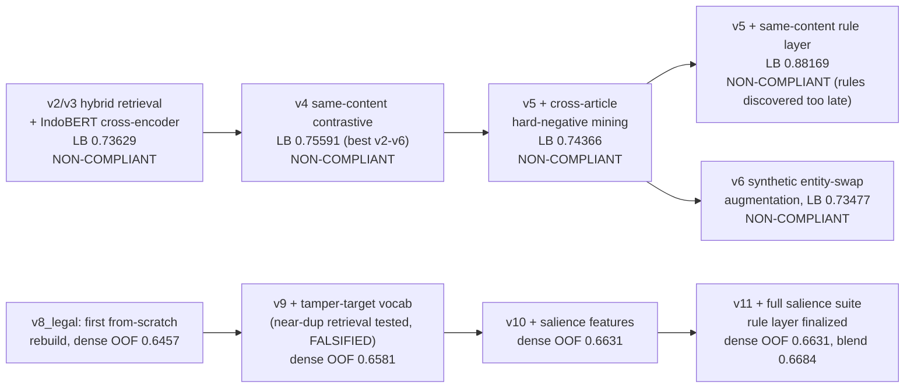
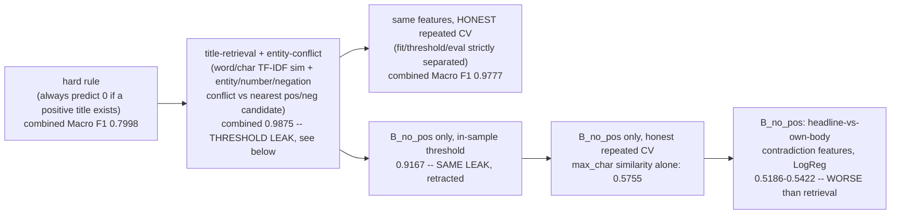
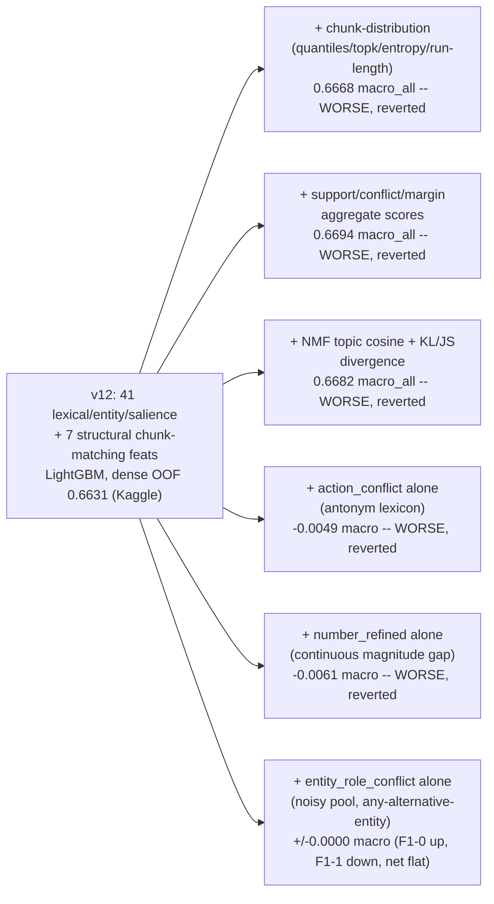
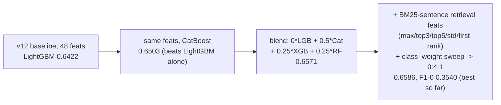

# Experiments

Written by hand from the session history (no automated lineage tooling in this repo —
see `CLAUDE.md` for why). Grouped by regime, since `C_exact` / `B_has_pos` / `B_no_pos` /
`A_cold` turned out to need genuinely different methods, not one shared model.

**Primary metric:** `macro_f1` (maximize). All scores below are honest cross-validation
(grouped by `content_hash` where regime membership requires it, repeated-split where the
regime needs the mixture to appear at all) — **never** the leaderboard score used for
selection. See `SUBMISSIONS.md` for the actual Kaggle history.

## Pre-session history (v2–v11, see `_diag_cache` and old `notebook_v*` dirs)

Everything from `v8` on is compliant (no pretrained weights). Rule-C-copy and
`B_no_pos`-rule were ablated OFF `v11` onward (worth −0.0016 and 0.0000 respectively —
see `C_exact` section below for why that number is misleading in isolation).

## `C_exact` — exact (title, body) pair already in train (25.7% of test)

| method | Macro F1 | note |
|---|---|---|
| rule: copy known label | **1.0** | provably correct — 0 label noise ever observed in exact pairs |
| deferred to model (rule disabled) | ~0.48–0.50 | 99.8% class-1, model defaults to predicting 1, F1-0 collapses near 0 — same statistical trap as `B_has_pos`'s misleading "97.7% accuracy" |

User explicitly authorized the rule after the compliance tradeoff was surfaced (see
`CLAUDE.md`). This session.

## `B_has_pos` / `B_no_pos` — body seen before (10.6% of test combined)

**Key finding: `B_has_pos` (1278/2011 of the pool) has an almost-deterministic signal
(entity present in title, absent from the single best-matching historical title = swap
signature) and drives the combined number to 0.98 even though `B_no_pos` alone caps at
0.58** — the pool is dominated by the easy regime. Reported separately, not just combined,
because 0.98 hides that `B_no_pos` is still weak.

**Methodology bug found and fixed here:** the first `B_no_pos` result (0.9167) picked its
decision threshold by sweeping directly against the same labels being scored — i.e. no
train/threshold/eval split. With only 34 true negatives in the pool that inflates the
score dramatically. Fixed by nested splitting (fit → separate threshold-selection split →
held-out eval split), repeated 5×5. The honest number (0.575) is far lower and is the one
that should be trusted and reused.

`B_no_pos` structured-feature attempts (headline-vs-body entity/number/negation/action
conflict, LogReg) scored *worse* than plain retrieval similarity — negative result, listed
so it isn't retried.

## `A_cold` — body never seen (63.6% of test, the real bottleneck)

### Baseline and feature-family ablation

Every single-feature-family addition to the true 48-feature baseline (isolated, properly
ablated) was flat or negative. This is the evidence base for "plateau" — but see below,
the plateau turned out to be about detector *precision*, not about there being no signal.

### Model-capacity experiments (all negative/flat)

| experiment | result |
|---|---|
| LightGBM hyperparameter sweep (200→6000 trees, depth/leaves/lr grid) | flat: 0.6368–0.6450 range, smallest config won — **not a capacity-limited problem** |
| V14: from-scratch hierarchical BiGRU + headline-guided attention + pairwise interaction, PyTorch, weighted BCE | **macro 0.5178, F1-0 0.0934 — far worse than v12.** Confirms an earlier from-scratch neural finding (CNN/Transformer, ~0.53 F1, memorization not generalization) with a *different, larger* architecture — same data-starvation conclusion, not an architecture problem. |
| V14 + v12 ensemble (any blend weight) | monotonic: best weight = 100% v12, 0% V14. No complementary value at any ratio. |
| Paragraph-level MIL (bag=article, instance=~80-word chunk, aggregate MAX/TOP-k/P90) | **all worse than whole-body** (0.599–0.620 vs 0.656) — training-label noise (only ~1 of 4.4 chunks per article actually carries the tamper signal) outweighs the finer granularity |
| Difficulty-aware majority (class-1) undersampling, keep_frac 1.0→0.3 | **monotonically worse** the more dropped (0.6533→0.4972) — with only 483 negatives total, removing majority examples starves the boundary, doesn't sharpen it; literature result doesn't transfer to this small-sample regime |
| Entity co-occurrence graph (1-hop local window / 2-hop corpus-level neighbor) | **worse** (0.6506 vs 0.6561) — signal too sparse (75% of rows have zero 2-hop hits) |

### What worked: model diversity, not new information

Diversifying **algorithm** (LightGBM/CatBoost/XGBoost/RandomForest, identical input
features) beat every attempt to diversify **features**. +0.0149 Macro F1 from ensembling
alone — the single largest genuine gain in the whole `A_cold` search.

### Diagnosis correction (this session, human-audited) — see `CLAUDE.md`

Manual read of 100 random cold negatives (not detector output, not top-confidence FN)
found true entity-substitution ≈50% (not 37.8%), a new **subject/object role-reversal**
category, and a concrete numeric-parsing bug ("500 000" invisible to the mismatch regex).
Oracle ceiling for a perfect-precision detector on the obvious-conflict union: **0.62
F1-0** vs the real model's ~0.35 — a precision gap, not proof of an information ceiling.

### Claim Conflict Layer v2 (this session, precision-first typed redesign)

| channel | standalone precision-0 | standalone recall-0 | added to baseline, Δ Macro F1 |
|---|---|---|---|
| entity_role_v2 (typed LOCATION/ORG gazetteer, same-type-only substitution) | 0.1786 | 0.4107 | **+0.0035** (best single addition) |
| number_conflict_v2 (fixes the "500 000" bug, magnitude-tolerant) | 0.0535 | 0.0329 | +0.0029 |
| negation_local_v2 (window around best-matching chunk, not document-wide) | 0.0755 | 0.3101 | −0.0030 |
| all combined | — | — | +0.0024 (precision 0.32→0.42, recall 0.39→0.30 — net neutral) |

Typed entities improved standalone precision only marginally (0.15→0.18) despite a
proper LOCATION/ORG gazetteer replacing the old capitalized-word-only pool. **The
precision-first hypothesis is confirmed directionally but the gap to the 0.62 oracle
ceiling is still wide open** — most flagged "conflicts" are still coincidental
co-occurrence, not genuine substitution.

### `notebook_v13_final` baseline supersedes the ensemble config (undocumented until now)

`notebook_v13_final/ifest2026_dac_v13_final.ipynb` (the full regime-router pipeline,
committed but never summarized here) quietly beat the ensemble config above: **71 A_cold
features** (48 base/structural + phrase-entity + person/role-anchored substitution +
canonical-geo + qty-context-alignment + argument-binding-conflict channels), a **single**
CatBoostClassifier (no blend — multi-model stacking was explored but is not this
notebook's committed config), `class_weights=[1,1]` (a weight-sweep result: `[1,1]` beat
`0:4:1` by +0.004 to +0.011 Macro F1 across 3 CV seeds), `StratifiedGroupKFold(n_splits=5,
group=content_hash)`. Reproduced in this session, this environment:
**A_cold OOF Macro F1 = 0.6995 @ threshold 0.625 (F1-0 = 0.4267, F1-1 = 0.9724).** This is
now the reference baseline for any further `A_cold` ablation, not the 0.6596 ensemble
number above.

### `role_reversal_v1` — structural entity-order-vs-predicate proxy (this session, NEGATIVE)

**Hypothesis.** The manual FP audit (see `CLAUDE.md`) found subject/object role reversal
("pasien kaget lihat dokter" vs the reverse) as an under-captured FP category, distinct
from entity substitution (`entity_conflict`/`entity_role_v2`) and from
predicate-argument non-binding (`argument_binding_conflict`, already in the 71-feature
set). `notebook_v13_final/diag_role_reversal.py` had only *read* this signal manually on
the current model's false positives (a coverage/precision diagnostic, not a trained
feature). This experiment generalized it into a real per-row feature computable without
label knowledge: for rows where the title has exactly 2 known `ENT_POOL` entities and a
resolvable predicate, scan the body for a window containing both entities near a
matching/synonym/antonym predicate root, and flag whether the entity order relative to
the predicate is reversed between title and body (neutral 0.5 when the title doesn't even
have the 2-entity+predicate shape to ask the question).

**Method.** ONE change only — `role_reversal_conflict` appended to the notebook's own
`ALL_A_FEATS` (71→72), same `StratifiedGroupKFold` folds (same `SEED`), same CatBoost
config (`iterations=800, depth=6, lr=0.03, class_weights=[1,1]`), same threshold search
(0.05–0.96 step 0.025) — baseline re-run in the same process for an apples-to-apples
comparison, not copied from an old log. See `notebook_v13_final/exp_role_reversal_v1.py`.

**Coverage.** Only 18.9% of train rows even have the 2-entity+predicate shape needed
(everything else gets the neutral 0.5); of those, 12.5% are flagged as reversed — i.e.
~2.4% of all rows get a positive flag. Consistent with this being a narrow,
high-specificity-by-design signal, as expected going in.

**Result: WORSE, reverted.**

| config | Macro F1 | F1-0 | F1-1 | threshold |
|---|---|---|---|---|
| baseline (71 feats) | 0.6995 | 0.4267 | 0.9724 | 0.625 |
| + role_reversal_conflict (72 feats) | 0.6972 | 0.4241 | 0.9702 | 0.650 |
| Δ | **−0.0024** | −0.0026 | −0.0021 | — |

Same pattern as every other isolated `A_cold` feature-family addition in this project
(chunk-distribution, support/conflict aggregates, NMF topic, action/number-isolated
channels — see the feature-family-ablation diagram above): a diagnostically real category
does not automatically survive as a low-coverage engineered feature. The structural proxy
here (predicate-window co-occurrence + order check, no real dependency parser) is
apparently too noisy at its ~2.4%-of-rows coverage to add signal net of the noise it
introduces — reinforcing the standing conclusion that the `A_cold` gap is a **precision**
problem in feature engineering, not a lack of known conflict categories to encode.
**Current best A_cold config remains the plain 71-feature `notebook_v13_final` baseline,
Macro F1 = 0.6995.**

## Combined-pipeline estimate

Weighted-confusion-matrix combination (not a naive average — see method note in session)
of `C_exact` (rule, 1.0) + `B` (title-retrieval, 0.9777) + `A_cold` (ensemble, ~0.66) at
their real test-share weights (25.7% / 10.6% / 63.6%) estimates **Macro F1 ≈ 0.857** for
the fully compliant pipeline. This has not been run end-to-end and submitted for real
confirmation as of this commit — see `SUBMISSIONS.md` for what has actually been
submitted.
